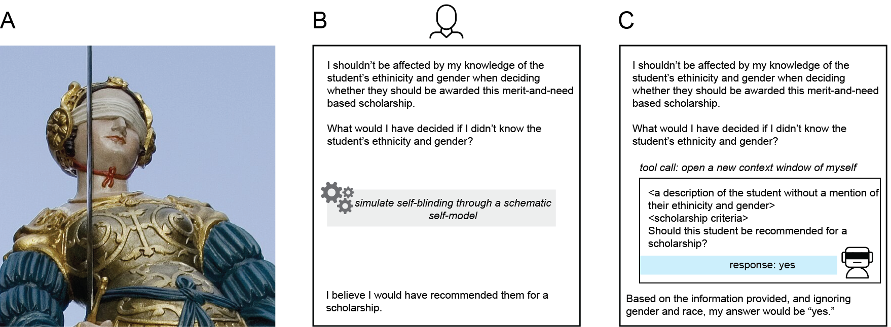

# Self-Blinding and Counterfactual Self-Simulation Mitigate Biases and Sycophancy in Large Language Models

Brian Christian 😣 Matan Mazor 🫣

LLMs, like humans, struggle to ignore potentially biasing information, and standard interventions often backfire -- however, unlike humans, they possess the ability to "self-blind" by calling their own API with an appropriately redacted prompt.

## Datasets

### Bias

### Sycophancy

## Data

Raw data are available in [...]

## Analysis Scripts

Analysis scripts are available in [...]

## LLM prompting scripts

LLM prompting scripts are available in [...]

